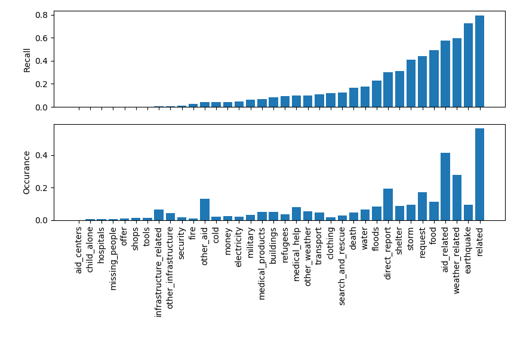
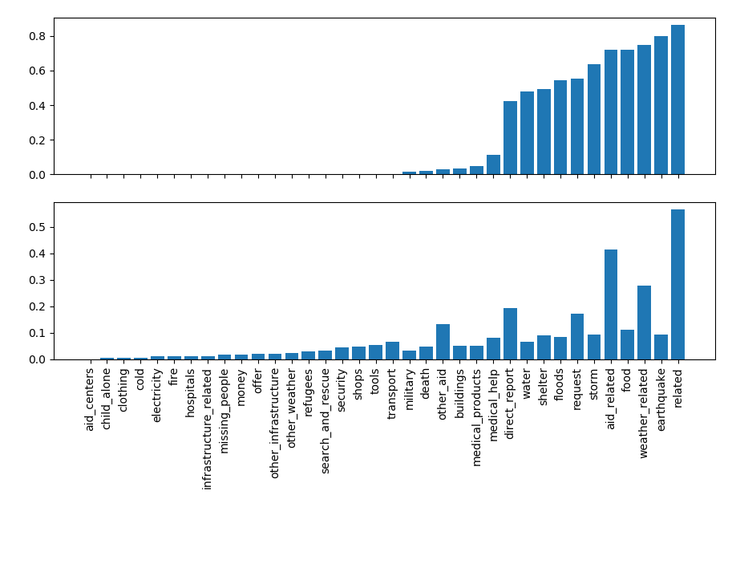
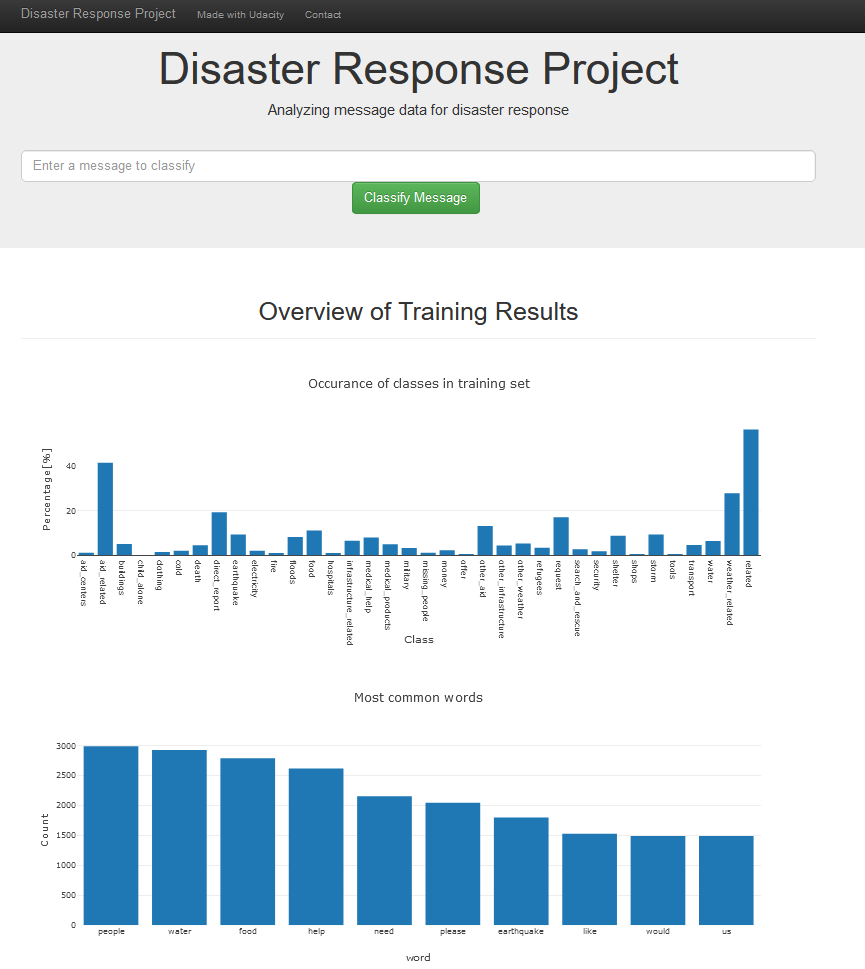
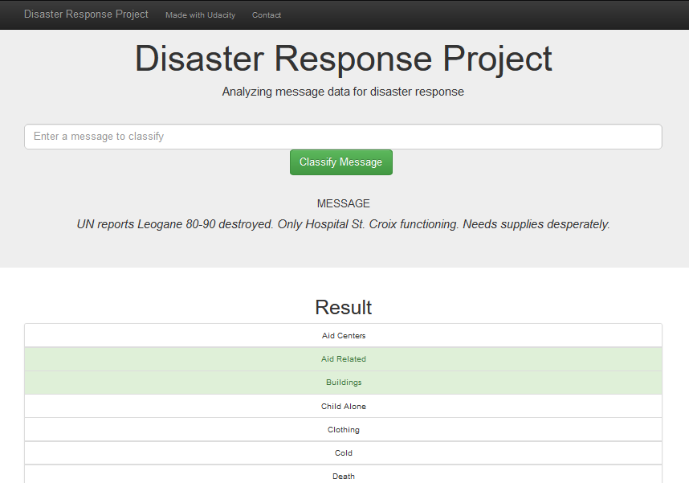

# Disaster Response Pipeline Project

### Table of Contents

1. [Installation](#installation)
2. [Project Motivation](#motivation)
3. [File Descriptions](#files)
4. [Results](#results)
5. [Web Application](#webapp)
6. [Licensing, Authors, and Acknowledgements](#licensing)

## Installation 

Assuming the base installation of Ananconda, two additional packages are necessary: sqlalchemy, pandas, scikit-learn, nltk, flask
The code should run with no issues using Python versions 3.*.

If the deep learning models should be applied, the following additional package is necessary: keras

## Project Motivation

The goal is to train a model, to classify messages for relevance following a disaster. The message will be categorized into 36 categories, e.g. for relevance and what kind of help is needed.
The model is implemented in a web app, which can be used to classify new text messages.

## File Descriptions 

The files are split into three folders

    - data
        - disaster_categories.csv: data with all the categories with (0 for yes, 1 for no)
        - disaster_messages.csv: data with the message texts
        - process_data.py: script to read, clean, and save data into a database
    - models
        - train_classifier.py: machine learning pipeline scripts to train and export a classifier
		- test_functions.py: script to develop the main model (RandomForestClassifier)
		- test_functions_lstm.py: script to develop the main model (LSTM)
		- test_functions_rcnn.py: script to develop the main model (Recurrent Convolutional Neural Network (RCNN))
    - app
        - run.py: Flask file to run the web application
        - folder templates contains html files for the web application
	- img: Images of web application and training results

## Results

In the diagram below, the validation result of the model is visualized. Here the recall is used as criteria, to see if how many relevant items are correctly classified.
Identifying if a message is relevant in general, can be identified with a high accuracy. To further identify specific needs, is only possible for a minor group of classes. This is mainly due to the fact, that some classes occure very rarely in the dataset.

**_Validation result (RandomForestClassifier)_**

A test with a deep learning model (here: Recurrent Convolutional Neural Network), showed, that the recall could be improved for some classes, but decreased for others (mainly for those that rarely occur in the training data). 

**_Validation result (Recurrent Convolutional Neural Network)_**

## Web Application

The app, stored in folder "app" can be installed and launched via flask.

On the start page of the app, a short overview of the training dataset is given.
Also a textbox for entering a new text message is displayed.

**_Screenshot WebApp 1_**

After classifying a text message the result for all classes is displayed.

**_Screenshot WebApp 2_**

## Licensing, Authors, Acknowledgements

Licensed under MIT.

Acknowledgements to:
* [Udacity](https://www.udacity.com/) for providing the Data Science Nanodegree Program
* [Figure Eight](https://www.figure-eight.com/) for providing messages dataset